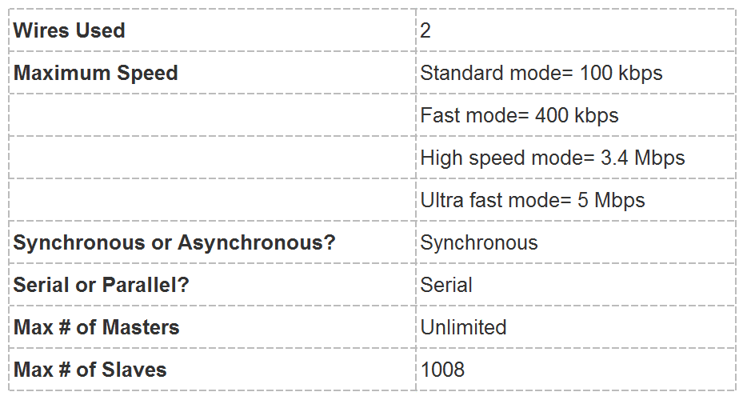

### I2C Protocol
I2C(Inter-Integrated Circuit) is syncronous, multi-slave, multi-master communication protocol used for connecting low-speed peripherals to microcontrollers and processors.It is use for short distance communication within a single device or PCB.

### working

- Both SDA and SCL lines are open-drain,requiring pull-up resistors.
- Data is transferred in 8-bit packets (bytes), with each byte follow by an acknowledgement (ACK) or non-acknowledgment (NACK) bit.
- The master initiates communication by sending a start condition, followed by the address of the target slave device.
- After the address, the master sends a read/write bit indicating the operation.
- The slave acknowledges the address by pulling the SDA line low.
- Data transfer begins, with each byte sent by the master being acknowledged by the slave.

### Key Features of I2C
1. Two-Wire Interface:
   - SDA (Serial Data Line): Carries data.
   - SCL (Serial Clock Line): Carries the clock signal.
2. Multi-Master and Multi-Slave:
   - Multiple master devices can control the bus.
   - Multiple slave devices can be controlled by the master(s).
3. Syncronous Communication:
   - Data transfer is syncronized with the clock signal.
4. Addressing:
   - Each slave device has a unique 7-bit or 10-bit address.

### Specifications - Table

