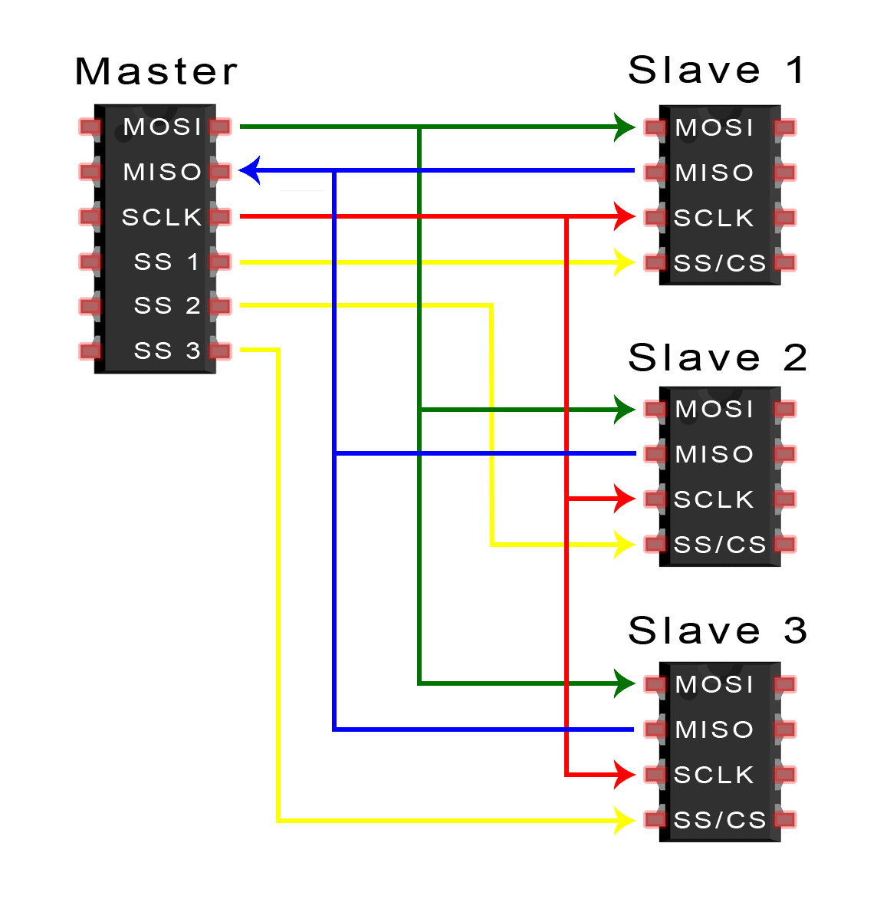

### SPI Protocol
SPI (Serial Peripheral Interface) is a synchronous serial communication protocol used primarily for short-distance communication, typically between microcontrollers and peripherals like sensors, SD cards, and shift register

### Working 
Devices communicating via SPI are in a master-slave relationship. The master is the controlling device (usually a microcontroller), while the slave (usually a sensor, display, or memory chip) takes instruction from the master. The simplest configuration of SPI is a single master, single slave system, but one master can control more than one slave (more on this below).

### Multiple Slaves
SPI can be set up to operate with a single master and a single slave, and it can be set up with multiple slaves controlled by a single master. There are two ways to connect multiple slaves to the master. If the master has multiple slave select pins, the slaves can be wired in parallel like this

If only one slave select pin is available, the slaves can be **daisy-chained** like this:

### Key features
1. Full-Duplex Communication: Data can be sent and received simultaneously.
2. Master-Slave Architecture: One master controls one or more slave devices.
3. Four-Wire Interface: SPI uses four main lines.
    * **MOSI (Master Out Slave In):** Carries data from the master to the slave.
    * **MISO (Master In Slave Out):** Carries data from the slave to the master.
    * **SCK (Serial Clock):** Clock signal generated by the master to synchronize data transfer.
    * **SS (Slave Select):** Also known as CS (Chip Select), used by the master to select which slave to communicate with.

